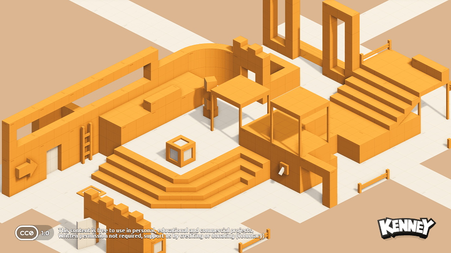
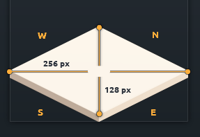
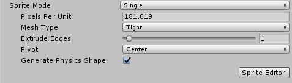
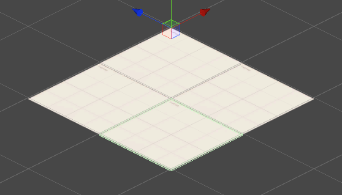
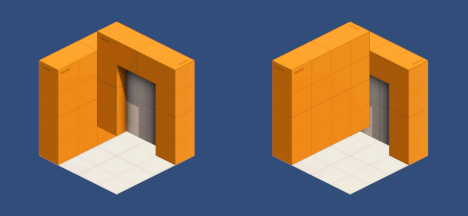
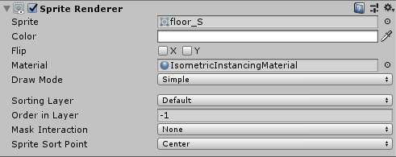
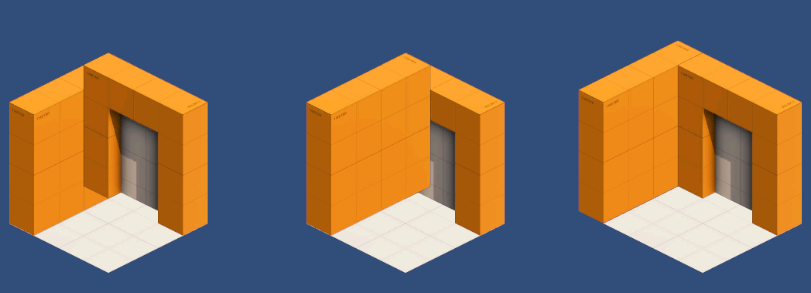

# Custom Sprites

You can of course use custom sprites using this asset. However there is some work to be done before you can use them in your game. So let's walk you through the process using kenney's isometric prototype tiles freely available and under public domain (CC0) on his [website](https://kenney.nl/assets/isometric-prototype-tiles).

!!! task
    Download the tiles and include them in your _Assets_ folder

## Import Settings

We have to set the pixels per unit value in the sprite's import settings so that each tile covers 1x1 units in the game. 
Each tile is 256 px in width and sqrt(2) units in length. 

That gives us **256 px/sqrt(2) = 181.02 ppu**    

!!! task
    In the sprite's import settings set the pixels per unit value to 181.02 for all sprites

This way each tile covers exactly 1x1 units

## Sorting Artifacts

Sorting artifacts are visual 'glitches' that typically happen in 2.5D games when sprites simply cannot be rendered so that they create the pseudo 3d look. 
These artifacts are unavoidable and a result of the fact that sprites do not have any depth information but can be minimized by careful consideration during level design. Consider the following example

No order of the _floor_, _door_ and _wall_ tiles exists so that the scene 'looks right'. So let's clean this up

## Order in layer

During level design it's often clear that some tiles are rendered before any other tile. For example the floor from the image above will always be rendered before anything else. So we can put it behind anything else in the rendering queue by setting a lower _Order in Layer_ value in the `SpriteRenderer` component.

## Reduce overlap

Sorting artifacts happen where sprites overlap. Reduce the amount of overlap and think about the logical order the sprites in your scene have to be rendered. 
From the example above we want to draw the floor first, then the outer wall, and finally the door. So let's offset the wall by a bit.

