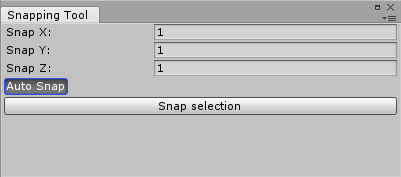

# Snapping Tool

The Snapping Tool is an utility tool that comes with the toolkit.
The Snapping Tool will help when setting up your scene.
The tool can be found under _Tools/Snapping Tool_ or press **Ctrl+L** (Command on Mac). You can find the source code under *Assets/UltimateIsometricToolkit/SnappingTool*. Although it is not recommend you may delete that folder and remove the tool from your project, the toolkit does not depend on it.  

## Snap Vector

The tool will snap the current selection in the hierarchy window to the closest increment of that vector.

## Auto Snap

When enabled will snap all `Transform` components in the current hierarchy window selection automatically.

## Snap selection

When pressed will snap all `Transform` components currently selected in the hierarchy window.
