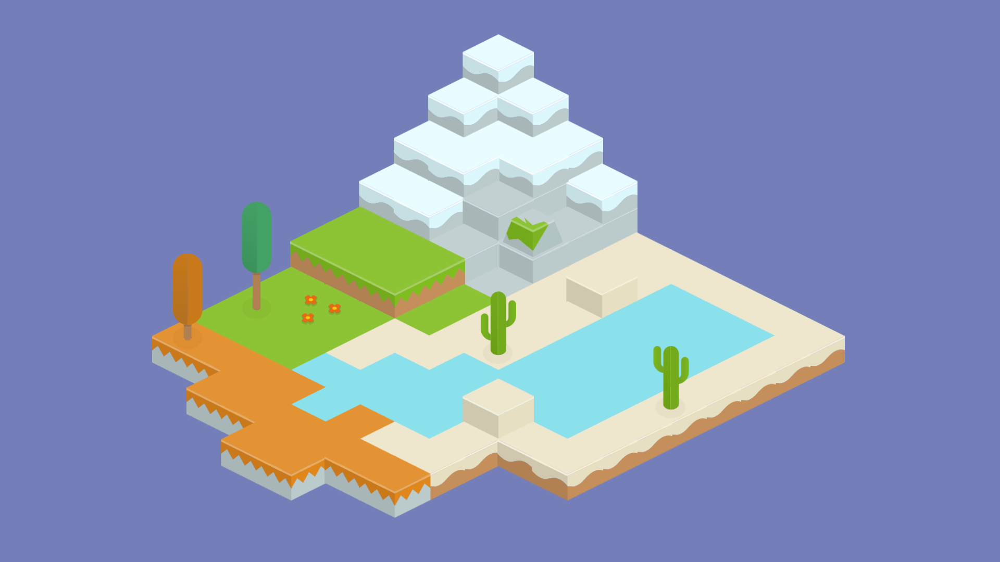

# The Ultimate Isometric Toolkit

A lightweight editor extension for Unity to create isometric games using 2d sprites.

## Features

* lightweight, at just a handful of core scripts  &mdash; We won't bloat your project folder!
* per frame depth sorting
* physics support using Unity's built-in 3D physics engine
* full integration into the Unity Editor &mdash; Using this asset should look and feel like it was always there to begin with.
* custom sprite support &mdash; Use whatever sprites you seem fit to express the vision for your game.
* support for various orthographic projections (isometric, dimetric, military, etc. )

and of course full source code access.